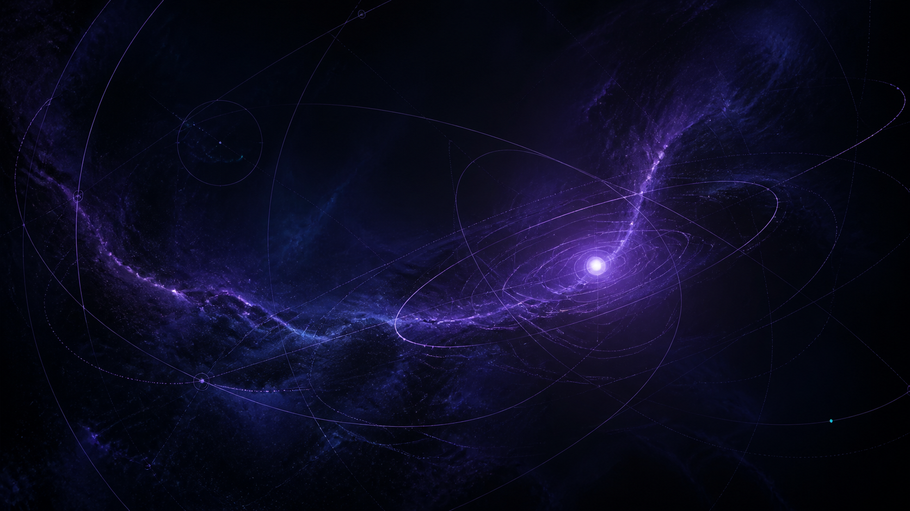

# Astralith



I wanted my computer to look good, and i didn't like how Serpantinum, Caelestia, DMS,
etc. looked. So i made my own desktop shell because i was incredibly bored and had a
bunch of random uncommitted blobs from the summer FOR it that i left uncommitted since
this wasn't a repository until mid august.

Astralith is the result. It is my Niri + Quickshell desktop, built around what I
think of when i think 'space'. Has most things made for it to be personal
to you. It is the place I actually use to work, listen, search, tune, capture,
and come back to whenever I am not using Enlightenment (dots for my E rice coming soon!)

## What it supports

The core session is working on Arch-based Niri systems. Astralith can run with
only its core runtime, then grows features as their desktop integrations become
available. I am only aware of it working flawlessly on Arch-based systems. If it
works elsewhere, send an issue, and this readme will change.

| Suite | What it does |
| --- | --- |
| **Aperture** | The top bar: workspaces, focused media, tray, time, and live system state. |
| **Ephemeris** | The expanding desktop instruments: app search, settings, audio routing, networking, power, telemetry, wallpaper, capture, calendar, focus, clipboard, notifications, media, lyrics, and weather. |
| **Parallax** | Wallpaper archive and workspace navigation. |
| **Resonance** | MPRIS media, lyrics, spectrum, and equalizer controls. |
| **Chronos** | Timers, stopwatch, focus cycles, and quick telemetry. |
| **Optics** | Region/full-screen capture, annotation, recording, and history. |
| **Transit** | Notifications, do-not-disturb, and clipboard history. |
| **Umbra** | A multi-output session lock, a safe lock preview, and an SDDM login theme. |

It also comes with Niri configuration, an Arch installer, a
transactional installer for more deliberate setups, update and validation
commands, Matugen-derived color, and optional native fluid surfaces.

## Install

Astralith is made for Arch Linux and derivatives first. This is the normal
bring-up route:

```bash
git clone https://github.com/deltadasher/Astralith.git
cd Astralith

./scripts/install-arch --recommended
astralithctl run
```

The installer installs missing dependencies, creates the user links, runs the
doctor and checks, and leaves the compositor configuration alone unless I ask
for it. To install Astralith's Niri configuration too:

```bash
./scripts/install-arch --recommended --install-niri-config
```

For a staged, reviewable installer instead, run `./scripts/install`. It opens a
small TUI and will show the plan before it changes anything.

After the first foreground run looks right:

```bash
astralithctl start
```

## The commands I use, which are not limited to

```text
astralithctl check                  Validate the checkout
astralithctl update                 Pull a clean checkout, check it, then restart
astralithctl restart                Reload the running shell
astralithctl lock                   Lock for real
```

`astralithctl help` is the complete map. `./scripts/doctor` tells me which
optional integrations are missing and exactly which parts of the suite they
would unlock.

## Controls I use

| Binding | Action |
| --- | --- |
| `Mod+Enter` | Terminal |
| `Mod+D` | Application catalog |
| `Mod+Shift+N` | Observatory settings |
| `Mod+Shift+Q` | Chronos |
| `Mod+Shift+W` | Wallpaper archive |
| `Mod+Shift+C` | Clipboard Orbit |
| `Mod+Shift+A` | Notification history |
| `Mod+Shift+S` | Region capture |
| `Super+Alt+L` | Umbra lock |

Terminology is currently the only "Enlightenment" thing that comes with this system. If you don't want it, delete it. It's just what I use since its feature-rich and stays sub 50mb with my configuration.
